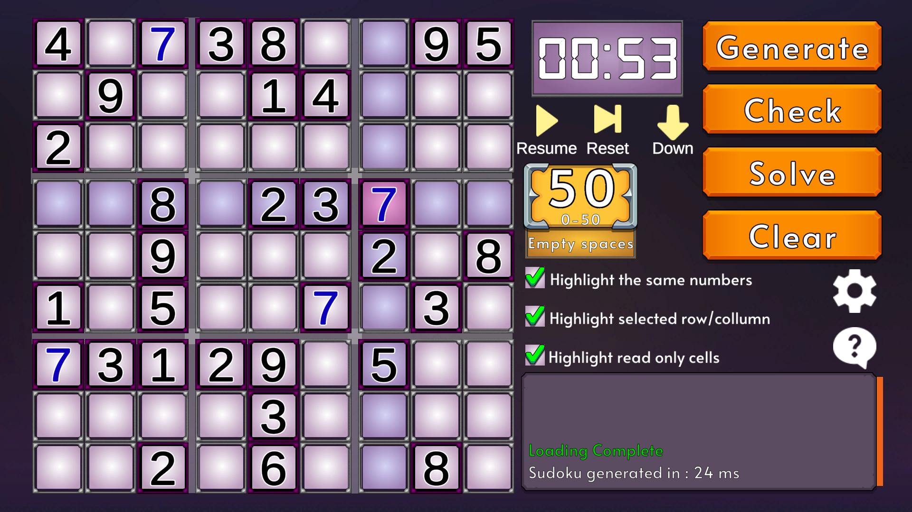
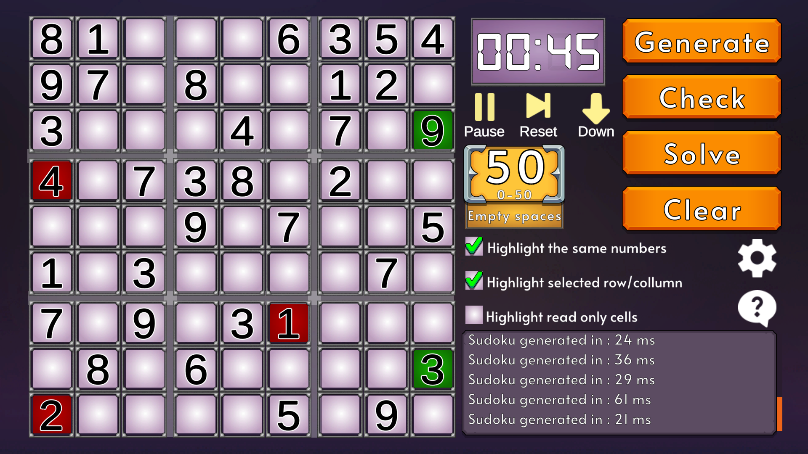

# SudokuGameDemo
Prosta gra stworzona w Unity, umożliwiając generowanie gotowych plansz sudoku, rozwiązywanie ich oraz sprawdzanie rozwiązań. Posiada również zegar z funkcjonalnością minutnika i stopera oraz możliwość zapisu i wczytania postępów.

# Screen Shots

  
 
